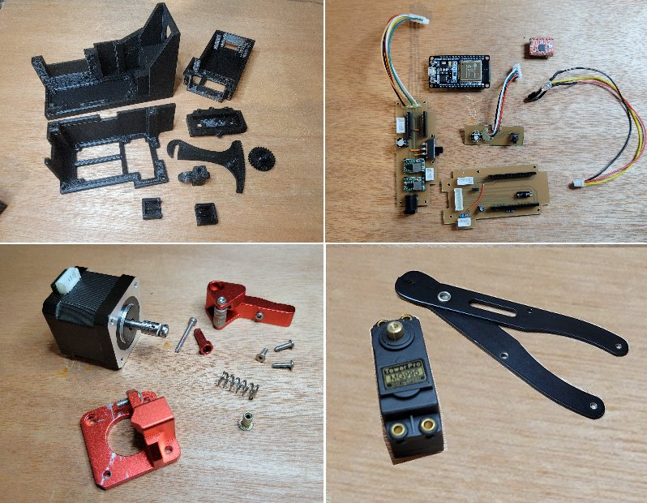

# wireStripper32 - Building the wireStripper

**[Home](readme.md)** --
**[Design](design.md)** --
**[Electronics](electronics.md)** --
**Build** --
**[Firmware](firmware.md)** --

**Next:** Installing the **[Firmware](firmware.md)** and testing the PCB ...

