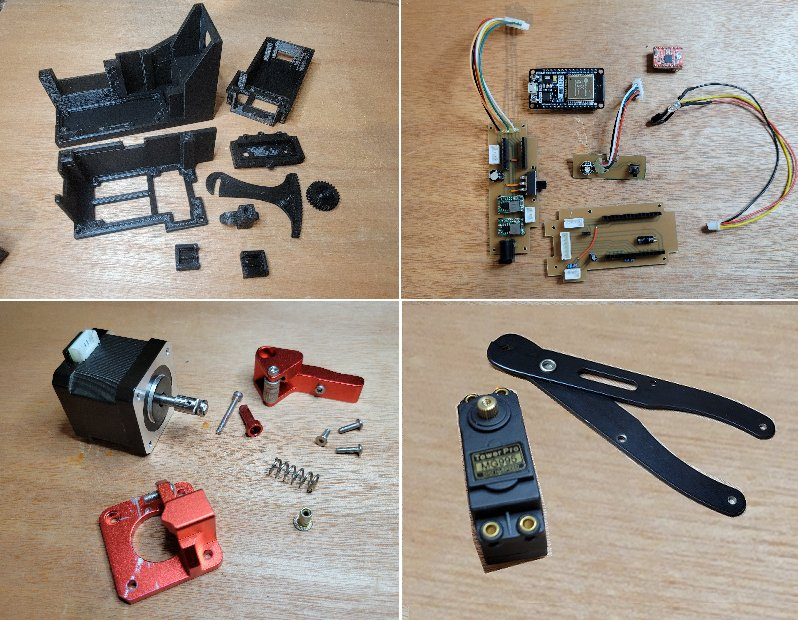

# wireStripper32 - Final Build

**[Home](readme.md)** --
**[Design](design.md)** --
**[Electronics](electronics.md)** --
**[Firmware](firmware.md)** --
**Build** --

**Done!!** Back to the [**beginning**](readme.md) ...