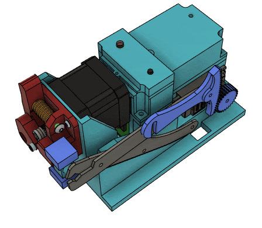

# wireStripper32 - Design

**[Home](readme.md)** --
**Design** --
**[Electronics](electronics.md)** --
**[Firmware](firmware.md)** --
**[Build](build.md)** --

**Next:** A look at the [**Electronics**](electronics.md) for the machine ...
