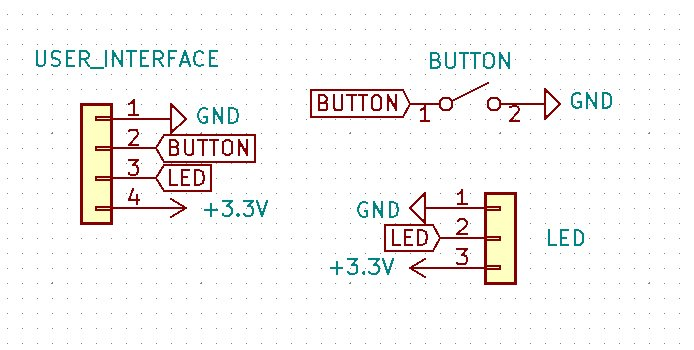

# wireStripper32 - Electronics

**[Home](readme.md)** --
**[Design](design.md)** --
**Electronics** --
**[Build](build.md)** --
**[Firmware](firmware.md)** --

This page shows all of the schematics, PCB designs, and has
photos of the completed circuit boards used in the wireStripper.
Please see the **/docs/kicad** folder for the actual schematics
and PCB designs.

## The Power Board

The *Power Board* takes a **12V DC** input and has two **buck converters* on it.
One buck converter produces **7V DC** (the maximum rated voltage) for the
Servo and the other convertor produces **5V** DC to go to the ESP32.
The Power Board has a **scocket** for the *A4988 stepper motor controller**,
and **plugs** for the *Nema17 stepper motor* and *MG995 Servo*.
The Power Board connects to the Main Board with a **6 pin cable** that
caries GND, 5V, the **Enable, Step, and Direction** signals for
the stepper motor, and the PWM signal for the *Servo*.

## The Main Board

The *Main Board* has a **socket** for the ESP32 dev board, and
**plugs** to connect it to the *Power Board*, the *IR Sensor*
LEDs, and the **UI Board**.   It also has a **jumper** that
allows the ESP32 to connect the **5V** from Power Board to the
*VIN pin* on the ESP32, along with a 100uf capacitor to smooth
out the 5V VIN power supply

## The UI (User Interface) Board

The UI board simply has a **push button** and a **WS2812b LED**
on it, along with a cable that reaches to the Main Board.

I used a 9mm circular WS2812b breakout board for the LED:

## The IR Sensor

The IR Sensor merely consists of an **850nm** *LED* (clear)
and *sensor* (black), soldered directly to a 3 pin JST wire
header with some heat shrink tubing.

The key is that the **LED is wired normally** with the anode
(the long leg) to the 3.3V power supply, but **the Sensor is
wired backwards** with the cathode (the short leg) connected
to the 3.3V power supply.

## Other Cables/Connectors

I also put a 4-pin JST connector on the end of a short standard
stepper motor cable,

and added a 3-pin JST connector to the (shorted) cable on the
Servo.

**Next:** - [**Building**](building.md) the wireStripper ..
