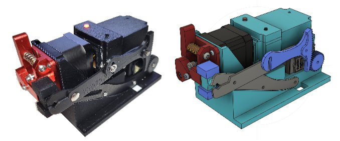

# wireStripper32 - Compact breadboard Wire Cutter and Stripper

**Home** --
**[Design](design.md)** --
**[Electronics](electronics.md)** --
**[Build](build.md)** --
**[Firmware](firmware.md)** --

I wanted to build a wire stripper to cut 22 guage solid core breadboard wire.
After a review of existing projects on YouTube and the web, I decided to
design my own.

- **Compact** - This design is very compact.  The wire cutter does not take
  up a lot of room on my desk or work surface.
- **Web UI** - There is no built in touch screen.  This saves on component
  costs and design complexity, by taking advantage of the ESP32's **wifi**
  capabilities to provide a *Web User Interface* that can be accessed from
  a cell phone or any other device with a browser on the LAN
- **Infrared Wire Sensor** - allows for easy **Loading** and **Unloading** of wire.
- **Single Button** - in addition to the *Web UI* there is a single
  button that can **Stop** the machine and **Unload or Load** the wire.
- **Common Tool** - the machine uses a commonly available inexpensive
  manual wire cutter.
- **Standard 12V Power Supply** - the machine uses a commonly available
  standard 2.5A 12V power supply and has an **On/Off** switch.

## Documentation Outline

The following pages of documentation are intended to as a *tutorial* for
a **maker** who is *building* this wire cutter/stripper:

- **[Design](design.md)** - An overview of the **requirements** and **design** of the machine
- **[Electronics](electronics.md)** - **Schematics**, **PCB layouts**, and **Cabling** details
- **[Build](build.md)** - **Building* the wireStripper
- **[Firmware](firmware.md)** - Compiling and installing the **Firmware** to the ESP32

## Files Available in this repository

This machine was *designed* using the **Fusion 360** CAD program and
the [**KiCAD**](https://www.kicad.org/) schematic and PCB design program.
The main outputs from Fusion 360 are the **STL Files** (3D models) used to
3D print the plastic parts.

The outputs from *KiCad* include the basic **schematic**, and
the **Gerber** and **Excellon** files used to make the PCBs.
The program [**FlatCAM**](https://bitbucket.org/jpcgt/flatcam/downloads/)
was used to generate the GCODE files from those files for running my
[**cnc3018**](https://github.com/phorton1/Arduino-esp32_cnc3018)
to **mill, epoxy coat, drill, and cut out** the PCBs (printed circuit boards).

The following sub-folders and their children can be found within this 'docs' folder

- [**fusion**](https://github.com/phorton1/Arduino-wireStripper32/tree/master/docs/fusion) -
   contains the final output *STL* files and *Fusion 360* design that produces them.
- [**kicad**](https://github.com/phorton1/Arduino-wireStripper32/tree/master/docs/kicad) -
  contains the **kiCAD** project, electronics schematics, and PCB design files
- [**prusa**](https://github.com/phorton1/Arduino-wireStripper32/tree/master/docs/kicad) -
  contains *projects* and *gcode* for printing the 3D plastic parts on a **Prusa MK3s** printer.

## Please Also See

This project directly makes direct use of my
[**MyIOT**](https://github.com/phorton1/Arduino-libraries-myIOT)
("my internet of things*) repository, which provides a generalized approach to
building parameter riven ESP32 devices that include a Web UI, as the
basis for the software.

Other project that also make user of the *myIOT* repository include the
[**Bilge Alarm**](https://github.com/phorton1/Arduino-bilgeAlarm)
that I built for my boat and
[**Wooden Geared Clock**](https://github.com/phorton1/Arduino-theClock3)
that uses an electromagnet to drive a pendulum.

The PCBs (printed circuit boards) were **milled** using the
[**cnc3018**](https://github.com/phorton1/Arduino-esp32_cnc3018) CNC
machine that I built.

I hope you will take a few minutes to check out some of these other pages too!!

## Credits

This project directly relies upon the public open source Arduino development system,
the Espressif ESP32 online documentation and additions to the Arduino IDE, as
well as a number open source Arduino libraries

I would like to thank the countless individuals who have contributed to making these
development tools, source codes, and documentation available for free public use, including,
but not limited to:

- [KiCad](https://www.kicad.org/)
- [FlatCAM](https://bitbucket.org/jpcgt/flatcam/downloads/) by **Juan Pablo Caram**
- [Arduino IDE and Libraries](https://www.arduino.cc/)
- [Espressif Systems](https://www.espressif.com/en/products/socs/esp32)
- [Adafruit NeoPixel Library](https://github.com/adafruit/Adafruit_NeoPixel)

## License

This program, project, and repository is free software: you can redistribute it and/or modify
it under the terms of the GNU General Public License Version 3 as published by
the Free Software Foundation.

These materials are distributed in the hope that they will be useful,
but WITHOUT ANY WARRANTY; without even the implied warranty of
MERCHANTABILITY or FITNESS FOR ANY PARTICULAR PURPOSE.  See the
GNU General Public License for more details.

Please see [LICENSE.TXT](../LICENSE.TXT) for more information.

**Next:** A [**Design Overview**](design.md) of the clock ...
